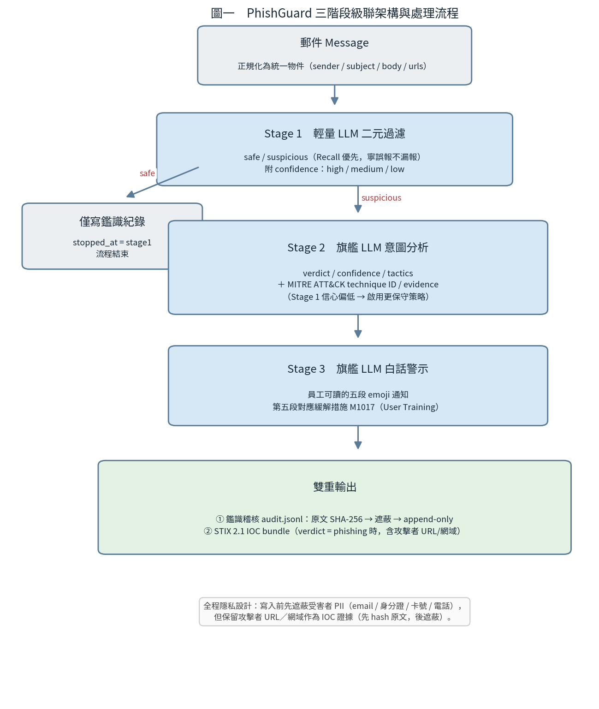

# PhishGuard — 多階段防釣魚與社交工程防禦網


> LLM-based multi-stage phishing and social engineering email defense PoC.
> 以大型語言模型驅動的三階段級聯（cascade）釣魚與 BEC 偵測管線，對齊台科大資安研究主軸（林俊叡老師）：
> **AI 輔助威脅狩獵 / 資安資料交換標準 / 數位鑑識 / 隱私設計 / 敏捷開發**。

專案憲法見 [CLAUDE.md](CLAUDE.md)；完整技術報告見 [`docs/`](docs/)。

---

## 1. Project Overview

PhishGuard 用三階段級聯偵測釣魚郵件與商業電子郵件詐騙（BEC）：先以低成本輕量模型過濾大量郵件，僅將少數可疑者交旗艦模型做意圖分析，再產生員工可讀警示與結構化威脅情資。設計同時追求**偵測準確（Recall/Precision 可調式平衡）**、**成本可控**、**輸出可供 SOC 直接使用**。

1. **Stage 1**　輕量 LLM 初篩：`safe / suspicious`（+ confidence）
2. **Stage 2**　旗艦 LLM 意圖分析：`verdict / confidence / tactics / MITRE ATT&CK technique ID / evidence`
3. **Stage 3**　旗艦 LLM 白話警示：員工可讀的五段 emoji 通知（對應緩解措施 M1017）
4. **雙重輸出**：append-only 鑑識稽核（原文 SHA-256）＋ STIX 2.1 IOC bundle

---

## 2. Week 12 Alignment

本系統的構想與架構係參酌課程 Week 12（《AI for Cybersecurity》）所揭示之概念設計：

| Week 12 概念（投影片） | PhishGuard 對應 |
|---|---|
| p.10 LLM/SLM 電子郵件安全、意圖式偵測（打 BEC） | Stage 1 輕量初篩 → Stage 2 旗艦意圖分析（與投影片管線一一對應） |
| p.23 PII 遮蔽「規則 vs LLM」的混合必要性 | `privacy.py` 採確定性 regex 遮蔽，確保可稽核、可重現、合規 |
| p.25 從非結構化文字抽結構化資料 | pydantic schema 驗證 Stage1/2/3 的 JSON 輸出、失敗重試 |
| p.3 / p.6 / p.8 / p.9 規則→ML→Transformer；語意/急迫性/社交工程線索 | 以 LLM 取代簽章規則，標記 tactics、urgency、sender inconsistency |
| p.17 / p.18 SOC 分流、告警疲勞、風險評分 | Stage 1 第一層分流；confidence 為非二元風險評分 |
| p.24 自動 IOC 萃取 | `ioc.py` 匯出 STIX 2.1 bundle |
| p.31 / p.33 可解釋性、可稽核事件紀錄 | evidence + MITRE technique ID + append-only 稽核 + SHA-256 |

---

## 3. System Architecture



```
Message -> [Stage 1 輕量過濾] - safe -----> 只寫鑑識紀錄，結束
                 | suspicious
                 v
          [Stage 2 旗艦意圖分析]  verdict / tactics / MITRE technique / evidence
                 v
          [Stage 3 旗艦白話警示]  員工五段 emoji 通知（M1017）
                 v
   雙重輸出：(1) audit.jsonl（原文 SHA-256、append-only） (2) STIX 2.1 IOC（phishing 時）
```

| 模組 | 職責 |
|---|---|
| [schema.py](src/phishguard/schema.py) | pydantic v2 模型（`Message`、`Stage1/2/3Result`） |
| [llm_client.py](src/phishguard/llm_client.py) | OpenAI 相容 client（指向 Ollama），`temperature=0`、呼叫計數 |
| [privacy.py](src/phishguard/privacy.py) | 隱私設計：遮蔽受害者 PII、保留攻擊者 URL |
| [stage1_filter.py](src/phishguard/stage1_filter.py) / [stage2_intent.py](src/phishguard/stage2_intent.py) / [stage3_briefing.py](src/phishguard/stage3_briefing.py) | 三階段 |
| [mitre.py](src/phishguard/mitre.py) | ATT&CK technique 驗證補正 + 緩解措施對照 |
| [forensics.py](src/phishguard/forensics.py) | 原文 SHA-256 + append-only 稽核日誌 |
| [ioc.py](src/phishguard/ioc.py) | STIX 2.1 IOC 匯出 |
| [pipeline.py](src/phishguard/pipeline.py) / [evaluation.py](src/phishguard/evaluation.py) | 串接三階段 + 鑑識 + IOC；評估與成本比較 |

### 教授對齊五條硬規則

| # | 規則 | 落實 |
|---|---|---|
| 1 | 威脅狩獵：tactics 附 MITRE ATT&CK technique ID | `mitre.py`，Stage 2 套用 |
| 2 | 資料交換標準：URL/網域/寄件者匯出 STIX 2.1 | `ioc.py` |
| 3 | 數位鑑識：case_id + ISO8601 + 原文 SHA-256、append-only | `forensics.py` |
| 4 | 隱私設計：寫入前先遮蔽受害者 PII | `privacy.py` |
| 5 | 證據保全：不遮蔽攻擊者 URL/網域（IOC） | 見 `privacy.py` 的 URL 保護順序 |

---

## 4. Quick Start

```bash
# 安裝
python -m venv .venv && source .venv/bin/activate   # Windows: .venv\Scripts\Activate.ps1
pip install -r requirements.txt && pip install -e .
cp .env.example .env                                  # 填入 Ollama 端點

# 跑單封郵件
python -m phishguard.pipeline --input data/self_made/case_01.json
# 網頁介面（貼郵件 -> 三階段判讀 -> STIX 下載）
streamlit run app.py
```

本專案以 **Ollama** 部署 **Qwen2.5**；`.env` 範例：

```
GLOWS_API_BASE=http://localhost:11434/v1   # Glows.ai GPU 上的 Ollama（OpenAI 相容）
GLOWS_API_KEY=ollama                        # Ollama 不驗金鑰，填任意非空字串
MODEL_STAGE1=qwen2.5:7b
MODEL_STAGE2=qwen2.5:14b
MODEL_STAGE3=qwen2.5:14b
```

## 5. Run Tests

```bash
pytest -q          # 86 passed；全程 mock，不需 .env、不需 GPU
```

## 6. Reproduce Evaluation

**(1) 程式與邏輯——完全確定性，不需 GPU**：`pip install -r requirements.txt && pytest -q` -> 86 passed。

**(2) 偵測數字——需 LLM 後端（Ollama + Qwen2.5 + GPU）**：

```bash
ollama pull qwen2.5:7b && ollama pull qwen2.5:14b
cp .env.example .env

# 自製集（已隨 repo 提供）
python eval/compare.py  --dataset data/eval/labeled.jsonl
python eval/evaluate.py --dataset data/eval/labeled.jsonl

# 公開集：由公開語料重建（seed=42 -> 同一組 100 封）
mkdir -p data/raw
wget -P data/raw https://spamassassin.apache.org/old/publiccorpus/20030228_easy_ham.tar.bz2
tar xjf data/raw/20030228_easy_ham.tar.bz2 -C data/raw
kaggle datasets download -d naserabdullahalam/phishing-email-dataset -p data/raw --unzip
python eval/build_public_dataset.py --ham data/raw/easy_ham --phish data/raw/Nazario.csv \
  --out data/eval/labeled_public.jsonl --per-class 50
python eval/compare.py  --dataset data/eval/labeled_public.jsonl
python eval/evaluate.py --dataset data/eval/labeled_public.jsonl
```

> 本評估對應 tag `v1.0`（評估程式自 commit `dcefbee` 起未再變更）。LLM 在 `temperature=0` 大致穩定，跨 Ollama 版本/量化/硬體可能略有差異，故重現數字與報告**接近、未必逐位元相同**。

## 7. Results

> 以下為摘要（對應 tag `v1.0`）；完整方法、逐類別表現與取捨見 [`docs/`](docs/)。

單一大模型 vs 三階段級聯（以「釣魚」為正類別）：

| 資料集 | 方法 | Precision | Recall | F1 | 旗艦呼叫 |
|---|---|---|---|---|---|
| 自製 50 | 單一大模型 | 1.000 | 1.000 | 1.000 | 50 |
| 自製 50 | 三階段級聯 | 1.000 | 1.000 | 1.000 | 25 |
| 公開 100 | 單一大模型 | 0.766 | 0.980 | 0.860 | 100 |
| 公開 100 | 三階段級聯 | 0.863 | 0.880 | 0.871 | 51 |

混淆矩陣（公開 100，由 P/R 與各 50 封推算，四捨五入）：

| 方法 | TP | FN | FP | TN |
|---|---|---|---|---|
| 單一大模型 | 49 | 1 | 15 | 35 |
| 三階段級聯 | 44 | 6 | 7 | 43 |

- 自製集兩法皆滿分（樣本同質、過於理想，屬「假性滿分」，無法區分優劣）。
- 公開集：級聯**誤報明顯較少**（FP 15->7，Precision 0.766->0.863），**代價是漏報略增**（FN 1->6，Recall 0.980->0.880）。並非全面勝出，而是取捨。

## 8. Cost Analysis

級聯把昂貴旗艦模型呼叫從 **100 次降至 51 次（約減 49%）**。但**總呼叫**由 100 升至 151（每封都先跑一次 7B）。若粗估 14B 約為 2 倍 7B 成本，在 **50/50 平衡集**上單一約 100 個「14B 當量」、級聯約 101 個——**總成本約略持平**。級聯真正大幅省成本之處是**企業真實流量「正常信遠多於釣魚信」**時：Stage 1 先以低成本攔下大量正常信，僅少數進旗艦模型，節省幅度才會明顯。

## 9. High-Recall vs Balanced Mode

本系統為**可調式**設計，可依場景切換操作點（調整 Stage 1 門檻或讓中等信心也轉保守）：

| 部署模式 | 適用情境 | 設計目標 | 可能代價 |
|---|---|---|---|
| **High-Recall**（近似 v1.1） | 銀行、醫院、政府等高風險 | 儘量降低漏報 | 誤報與旗艦成本增加 |
| **Balanced / SOC**（v1.2，現況） | 一般企業郵件流量 | 降低誤報與告警疲勞 | Recall 可能略降 |

## 10. Limitations

- **語言**：公開評估集（SpamAssassin、Nazario）為英文，系統 prompt 為中文（模型仍能處理）。
- **樣本規模**：自製 50 / 公開 100，受 GPU 成本限制。
- **時間漂移**：Nazario 語料年代較早。
- **LLM 變異**：單次執行（temperature=0），跨環境數字接近但未必相同。
- **Prompt injection / 對抗式釣魚**：尚未系統性測試（如內文夾帶「Ignore previous instructions…」）；未來應建對抗式 benchmark。
- **Base-rate 差異**：50/50 平衡集與企業真實 base rate 不同，Precision、告警量與省成本幅度需在真實 base rate 下重估。
- **範圍固定 email**：`Message.channel` 保留 `line` 欄位供未來擴充。

## 11. AI Tool Usage Statement

本專案於開發與報告撰寫過程中使用 Anthropic 之 **Claude (Opus 4.8)** 作為輔助工具，協助程式碼審查與重構建議、各階段實作與測試撰寫、評估腳本，以及報告草擬。**所有設計決策、實驗執行（含 Glows.ai 上之模型部署與評估）、結果判讀與最終內容，均由作者檢核並負完全責任**；所有評估數據皆來自作者實際執行。

## 12. Citation / References

- The Apache SpamAssassin Project. *SpamAssassin Public Corpus.* https://spamassassin.apache.org/old/publiccorpus/
- Nazario, J. (2005). *Nazario Phishing Corpus.* https://monkey.org/~jose/phishing/
- Champa, A. I., Rabbi, M. F., & Zibran, M. F. (2024). *Why Phishing Emails Escape Detection: A Closer Look at the Failure Points.* 12th ISDFS.
- Alhuzali, A., et al. (2025). *In-depth Analysis of Phishing Email Detection... Across Multiple Datasets.* Applied Sciences, 15(6), 3396. https://doi.org/10.3390/app15063396
- Al-Subaiey, A., et al. (2024). *Novel Interpretable and Robust Web-based AI Platform for Phishing Email Detection.* arXiv:2405.11619. https://arxiv.org/abs/2405.11619
- The MITRE Corporation. *MITRE ATT&CK* (T1566 Phishing; M1017 User Training). https://attack.mitre.org/
- OASIS Open. (2021). *STIX Version 2.1.* https://docs.oasis-open.org/cti/stix/v2.1/os/stix-v2.1-os.html
- Qwen Team, Alibaba Group. *Qwen2.5.* https://qwenlm.github.io/
- Anthropic. (2026). *Claude (Opus 4.8)* [Large language model]. https://www.anthropic.com/claude
- Lin, R.（林俊叡）. *AI for Cybersecurity: Mastering the Transformer Revolution in Digital Defense*（課程 Week 12 講義）.

## 不入版控

`.env`、`data/raw/`、`reports/`、`logs/`、`.venv/` 皆於 [.gitignore](.gitignore) 排除。
